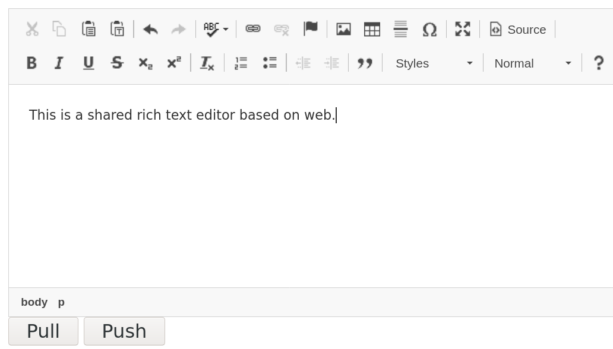

[TOC]

# Introduction

1. A shared rich text editor based on web.
2. Dependences
   1. [online-clipboard](https://github.com/ety001/online-clipboard) 
   2. [ckeditor4](https://ckeditor.com/ckeditor-4/)
   3. [jQuery](https://jquery.com/)

# Next Plan

1. Support on editable username and password
2. Support multi-point login, register and publish
3. Adapt for small phone

# Environment

1. php7.3
2. php7.3-fpm
3. php7.3-redis
4. nodejs
5. npm
6. http server

# Screenshots

